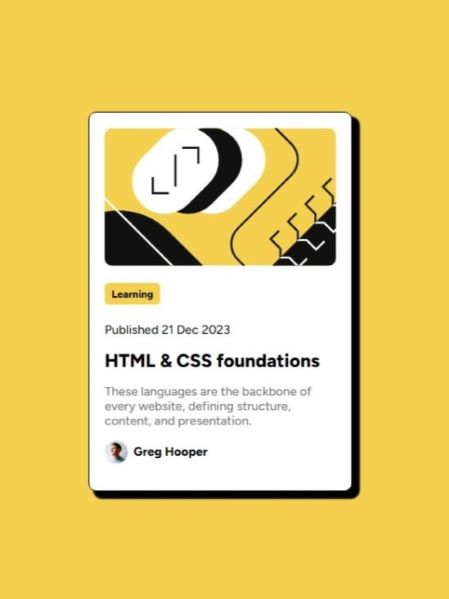

# Frontend Mentor - Blog preview card solution

This is a solution to the [Blog preview card challenge on Frontend Mentor](https://www.frontendmentor.io/challenges/blog-preview-card-ckPaj01IcS). Frontend Mentor challenges help you improve your coding skills by building realistic projects. 

## Table of contents

- [Overview](#overview)
  - [Screenshot](#screenshot)
  - [Links](#links)
- [My process](#my-process)
  - [Built with](#built-with)
  - [What I learned](#what-i-learned)
  - [Useful resources](#useful-resources)
- [Author](#author)

**Note: Delete this note and update the table of contents based on what sections you keep.**

## Overview

### Screenshot



### Links

- Live Site URL: [GitHub Pages](https://originalmistake.github.io/blogpreviewcard-repo/)

## My process

### Built with

- HTML
- CSS

### What I learned

```html
<h4>&nbsp; Greg Hooper</h4>
```
```css
.card #photo {
    max-width: 10%;
    max-height: 10%;
    float: left;
}

.card h4 {
    font-family: 'Figtree';
    font-weight: 800;
    text-align: left;
}
```

### Useful resources

- [Stack Overflow](https://stackoverflow.com/questions/66583940/how-to-make-a-space-between-icon-and-text-in-css#:~:text=Use%20space%20or%20%26nbsp%20between%20text%20and%20icon.%20Also%20plz%20put%20%3B%20after%20%26nbsp) - This helped me to add a space between the profile icon and text.
- [Stack Overflow](https://stackoverflow.com/questions/17219757/how-to-place-text-and-an-image-next-to-each-other-in-html#:~:text=img%20%7B%0A%20%20%20%20float%3Aleft%3B%0A%7D%0Ah3%20%7B%0A%20%20%20%20float%3Aright%3B%0A%7D) - Helped me with adding the profile icon and text next to each other.

## Author

- GitHub - [OriginalMistake](https://github.com/OriginalMistake)
- Frontend Mentor - [@OriginalMistake](https://www.frontendmentor.io/profile/OriginalMistake)
